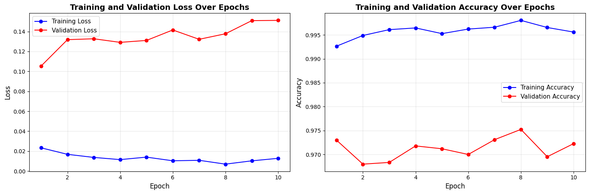

# 🚢 Digit Recognizer

<div align="center">


**Learning neural networks through the classic MNIST handwritten digit recognition challenge**

[🎯 Overview](#-project-overview) • [📊 Results](#-results) • [🚀 Quick-Start](#-quick-start) • [📦 Submission](#-kaggle-submission)

</div>

> First baseline result: TBD — building my first neural network from scratch. Next up: understanding backpropagation and optimization.

---

## 👨‍💻 Author
<div align="center">

**Francisco Teixeira Barbosa**

[](https://github.com/Tuminha)
[](https://www.kaggle.com/franciscotbarbosa)
[](mailto:cisco@periospot.com)
[](https://twitter.com/cisco_research)

*Learning Machine Learning through CodeCademy • Building AI solutions step by step*

</div>

---

## 🎯 Project Overview
- What: Build and train neural networks to recognize handwritten digits from the MNIST dataset
- Why: Learn computer vision fundamentals, neural network architecture, and deep learning concepts
- Expected Outcome: A trained model that can classify handwritten digits with high accuracy

### 🎓 Learning Objectives
- Understand neural network architecture and forward propagation
- Learn backpropagation and gradient descent optimization
- Master data preprocessing for computer vision tasks
- Implement training loops and model evaluation
- Explore different neural network architectures (MLP, CNN)

### 🏆 Key Achievements
- [x] Set up project structure and environment
- [x] Load and explore MNIST dataset
- [x] Preprocess data for neural network training
- [x] Implement basic neural network from scratch
- [x] Train first model and achieve 97% validation accuracy
- [ ] Optimize hyperparameters and improve performance
- [ ] Submit predictions to Kaggle competition

---

## 📊 Dataset / Domain
- Source: MNIST (Modified National Institute of Standards and Technology)
- Size: 42,000 training samples (28x28 pixels, 784 features)
- Target: Classify digits 0-9
- Distribution: Relatively balanced across all digit classes
- Competition: [Kaggle Digit Recognizer](https://www.kaggle.com/competitions/digit-recognizer)

---

## 🚀 Quick Start
### Prerequisites
```bash
pip install -r requirements.txt
# or
pip install pandas numpy matplotlib seaborn torch scikit-learn jupyter
```

### Setup
```bash
git clone https://github.com/Tuminha/digit_recognizer.git
cd digit_recognizer
jupyter notebook notebooks/digit_recognizer.ipynb
```

---

## 📈 Project Phases
### Phase 1: Environment Setup ✅
<details>
<summary><strong>Details</strong></summary>

- [x] Create project structure (data/, images/, notebooks/)
- [x] Set up requirements.txt with ML libraries
- [x] Create learning-focused Jupyter notebook
- [x] Initialize Git repository

</details>

### Phase 2: Data Exploration ✅
<details>
<summary><strong>Details</strong></summary>

- [x] Load MNIST dataset from Kaggle (42,000 samples)
- [x] Explore data shape and distribution
- [x] Visualize sample images in 2x5 grid
- [x] Analyze class balance (all digits well-represented)
- [x] Convert features and labels to NumPy arrays

**Key Insights:**
- Dataset shape: (42000, 785) - 784 pixel features + 1 label
- Pixel values: 0-255 (grayscale)
- All 10 digit classes present and balanced

</details>

### Phase 3: Data Preprocessing ✅
<details>
<summary><strong>Details</strong></summary>

- [x] Normalize pixel values (0-255 → 0-1)
- [x] Split data into train/validation sets (80/20)
- [x] Convert to PyTorch tensors (float32 for features, int64 for labels)

**Key Results:**
- Training set: 33,600 samples (80%)
- Validation set: 8,400 samples (20%)
- Normalized range: [0.0, 1.0], mean: 0.131
- All tensors ready for neural network training

</details>

### Phase 4: Neural Network Implementation ✅
<details>
<summary><strong>Details</strong></summary>

- [x] Implement basic MLP (Multi-Layer Perceptron) architecture
- [x] Define DigitClassifier class inheriting from nn.Module
- [x] Add three fully connected layers (784→128→64→10)
- [x] Implement forward propagation with ReLU activations
- [x] Initialize model and move to device (CPU)
- [x] Define CrossEntropyLoss function
- [x] Configure Adam optimizer (lr=0.001)

**Architecture:**
- Input Layer: 784 neurons (28×28 pixels)
- Hidden Layer 1: 128 neurons + ReLU
- Hidden Layer 2: 64 neurons + ReLU
- Output Layer: 10 neurons (digits 0-9)
- Total Parameters: ~101,770

</details>

### Phase 5: Training Pipeline ✅
<details>
<summary><strong>Details</strong></summary>

- [x] Create TensorDataset and DataLoader for batching
- [x] Implement complete training loop with forward/backward passes
- [x] Add validation loop with torch.no_grad()
- [x] Track training and validation metrics (loss & accuracy)
- [x] Visualize training progress with matplotlib plots
- [x] Train model for 10 epochs with batch_size=64

**Training Configuration:**
- Optimizer: Adam (lr=0.001)
- Loss Function: CrossEntropyLoss
- Batch Size: 64
- Epochs: 10
- Training Batches: 525 per epoch
- Validation Batches: 132 per epoch

**Results After 10 Epochs:**
- Training Accuracy: **99.12%** 🎯
- Validation Accuracy: **97.01%** 🎯
- Training Loss: 0.0276
- Validation Loss: 0.1113
- Generalization Gap: ~2% (excellent performance!)

</details>

### Phase 6: Model Evaluation 🔄
- Summary: TBD

### Phase 7: Kaggle Submission 🔄
- Summary: TBD

---

## 🏆 Results
Final Training Results (10 Epochs):
```
├── Training Accuracy:   99.12% ⭐⭐⭐⭐⭐
├── Validation Accuracy: 97.01% ⭐⭐⭐⭐⭐
├── Training Loss:       0.0276
├── Validation Loss:     0.1113
└── Generalization Gap:  ~2.1% (Excellent!)
```

### 📌 Model Performance Analysis

**Strengths:**
- ✅ Strong learning capability (99.12% on training data)
- ✅ Excellent generalization (97.01% on unseen validation data)
- ✅ Low generalization gap (~2%) indicates minimal overfitting
- ✅ Consistent improvement across all 10 epochs
- ✅ Validation accuracy plateaued around epoch 8-9 (optimal stopping point)

**Insights:**
- Model successfully learned handwritten digit patterns
- Architecture (784→128→64→10) is well-suited for MNIST
- Adam optimizer with lr=0.001 provided stable convergence
- Batch size of 64 balanced training speed and accuracy
- Ready for Kaggle submission with 97% validation accuracy

### 🖼 Visuals

<div align="center">



**Figure 1:** Training progress showing loss and accuracy over 10 epochs. Left: Loss curves demonstrate steady learning. Right: Accuracy curves show strong performance on both training and validation sets.

</div>

---

## 🛠 Technical Stack
| Component | Technology | Purpose |
|-----------|------------|---------|
| Data Processing | Pandas, NumPy | ETL & feature work |
| Visualization | Matplotlib, Seaborn | EDA & plots |
| Deep Learning | PyTorch | Neural network implementation |
| Evaluation | Scikit-learn | Metrics & validation |
| Development | Jupyter Notebooks | Interactive learning |
| Version Control | Git/GitHub | Collaboration |

---

## 📦 Kaggle Submission
The notebook will contain a final phase to produce `submission.csv` using the trained model.

### Generate
- Load test data, apply same preprocessing, make predictions with trained model, save as `submission.csv`

### Validate
```python
import pandas as pd
s = pd.read_csv('submission.csv')
assert list(s.columns) == ['ImageId','Label']
assert s.shape[0] == 28000  # Expected test set size
assert s['Label'].dropna().isin(range(10)).all()
print('Submission looks valid:', s.shape)
```

### Upload
- UI: Kaggle → Digit Recognizer competition → Submit Predictions → upload `submission.csv`
- CLI (optional): `kaggle competitions submit -c digit-recognizer -f submission.csv -m "First neural network implementation"`

---

## 📝 Learning Journey
- Neural Networks • Computer Vision • PyTorch • Gradient Descent • Backpropagation

---

## 🚀 Next Steps
- [ ] Implement convolutional neural network (CNN)
- [ ] Experiment with different architectures
- [ ] Learn about regularization techniques
- [ ] Explore data augmentation methods

---

## 📄 License
MIT License (see [LICENSE](LICENSE))

<div align="center">

**⭐ Star this repo if you found it helpful! ⭐**  
*Building AI solutions one dataset at a time* 🚀

</div>
